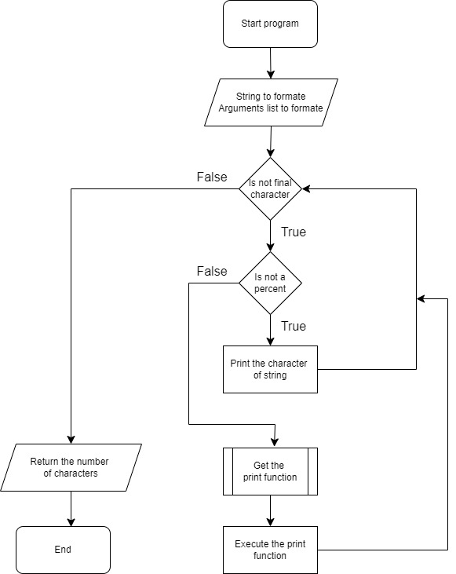
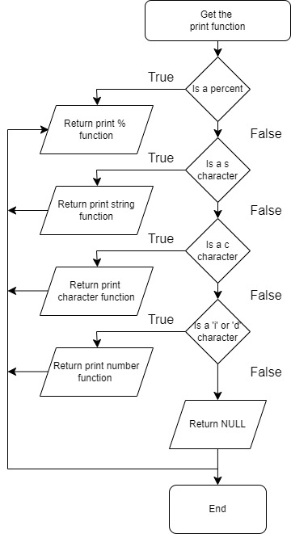

# HOLBERTON SCHOOL PRINTF PROJECT

This repository holds the code for a custom implementation of the `printf` function, a foundational project by the students of Holberton School. This custom `printf` mirrors the functionality of the standard C library `printf` function. The project is a collaborative effort between [Charlène SCOMPARIN](https://github.com/ChSPN) and [James JAROSZ](https://github.com/jmsjrz).

## PROJECT OVERVIEW

- **Objective:** To replicate the functionality of the standard `printf` function in C.
- **Compilation Command:** `gcc -Wall -Werror -Wextra -pedantic -std=gnu89 -Wno-format *.c`
- **Environment:** Ubuntu 20.04 LTS.
- **Coding Style:** Betty style for both coding and documentation.

## UML DIAGRAM OVERVIEW (Unified Modeling Language)



## REQUIREMENTS

- **Editors:** vi, vim, emacs.
- All files must end with a newline.
- The code must adhere to the Betty style and documentation guidelines.
- No global variables allowed.
- A maximum of 5 functions per file.
- Function prototypes should be included in the header file `main.h`.
- All header files must have include guards.
- Do not push any C file containing a `main` function at the root directory of your project.

## AUTHORIZED FUNCTIONS AND MACROS

- `write` (man 2 write)
- `malloc` (man 3 malloc)
- `free` (man 3 free)
- `va_start` (man 3 va_start)
- `va_end` (man 3 va_end)
- `va_copy` (man 3 va_copy)
- `va_arg` (man 3 va_arg)

## USAGE INSTRUCTIONS

To use this custom `_printf` implementation, include the header file `main.h` in your program and compile your code along with the `_printf` source files using the specified compilation command. Example usage is as follows:

```c
#include "main.h"

int main(void) {
    _printf("Welcome to Holberton School Printf project!\n");
    return (0);
}
```

## COMPILATION

```
gcc -Wall -Werror -Wextra -pedantic -std=gnu89 -Wno-format *.c -o output
./output
```

## CONTRIBUTIONS

Contributions, issues, and feature requests are welcome! Feel free to check [issues page](https://github.com/jmsjrz/holbertonschool-printf/issues). If you want to contribute, please fork the repository and use a feature branch. Pull requests are warmly welcome.


## AUTHORS

- [Charlène SCOMPARIN](https://github.com/ChSPN) - Initial work & contributions.
- [James JAROSZ](https://github.com/jmsjrz) - Initial work & contributions.


<br>
<br>
<br>
<br>

A AJOUTER:
- MAN PAGE (comment l'utiliser, courte présentation)
- TESTING (test d'un printf réel suivi d'un _printf)
- AJOUTER L'OUTPUT DE L'EXEMPLE SITUE DANS USAGE INSTRUCTION
- AJOUTER UN DETAIL DES FORMATS (c, s, %, d, i)
- AJOUTER DANS INSTRUCTION COMMENT UTILISER LE PROTOTYPE, ETC... 
